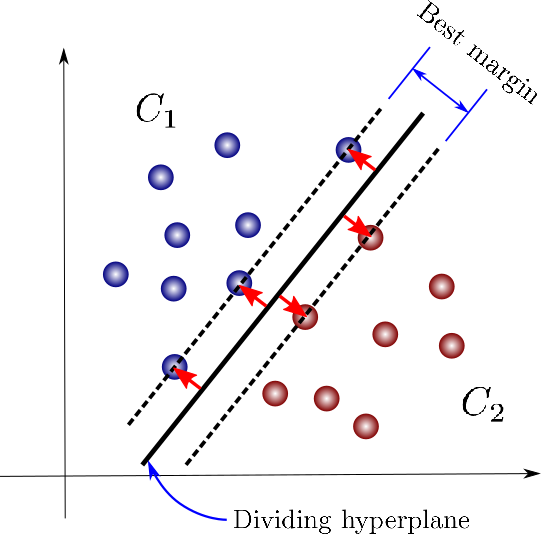
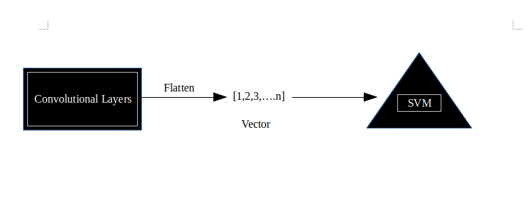

# C - SVM
For the new combining between 2 enemies in Machine-Learning field, CNN and SVM can bring out the magic things for face-recognition problem based on their technique

# The Eternal Feud
After the first paper about CNN was appeared by Yann Lecun, CNN becomes one of the best ideas beyond what people alway thing about his brother - multiple perceptron layers (MLP-ANN) and his bad father - Perceptron. CNN has survived over a decade and continues living with the passion changing the way we thought

Then, a man called SVM comes. He attacks every corner, every topic,... He showed his power and how better he is in front of his opponent - CNN. His reputation is getting bigger every day. People always talk about Machine Learning and SVM like a twin brother, can't separate.

CNN still hoping one day he will be back and get what he deserved. Even though most of the research at the time is all about his "hatest friend". CNN still believe in his technique is the way that the brain is working

The godfathers are bringing so much love and knowledge to come. Clearing the fog and blowing the fresh winds to the cold and lonely research environment, actually open a new era for the smart brain algorithm

# CNN
The familiar algorithm of deep learning fans is always the spectacular choice for those who never work with it and also the master in this field.

CNN's father combined convolutional and neural network classification layers into one. After that, they created a convolutional neural network (CNN). But the main point right now is all about convolution, this technique is one and only, comparing with traditional extracting feature such as HOG, SIFT, SURF,... convolution can find its voice in this topic

  

# SVM
To replace the badness of the second layers of CNN (MLP-ANN). SVM wants to prove that his classification skill is an icon of Machine Learning industry and still bringing the best of the best solution for classifying topic

  

# Implementation
Coding techique
* Detection:
    + Using code pre-trained CNN to detect human faces and skip all non-face and fake-face windows.
    + Instead of using features detect such as Viola-Jones, MTCNN,... pre-trained and caffe-DL are the best choice for the perfomance issue and accuracy.
* Recognition:
    + Replace Fully connected-layers inside of CNN by Support Vector Machine (SVM).
    + Continue applying VGG-16 pre-trained model to extract features from the image.

  

